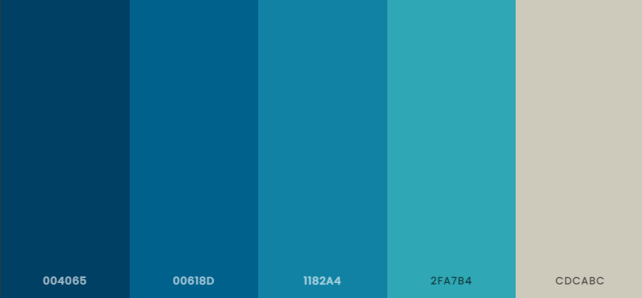
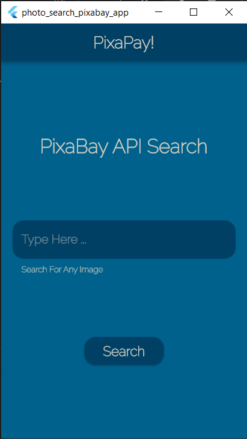
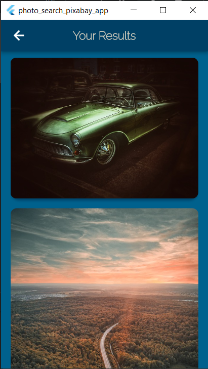

# Photo Search App 

This is a simple app that uses pixabay API to search images based on keywords. You can enter any keyword and get back a list of results, once the images are retrieved the images are displayed on your screen.

This App is built using flutter as a framework

## Color palette


<!--  -->

## App Screens

<div>
  
  
  
</div>

<!--   -->

## App Demo


<!--  -->

### Dependencies

[https://pub.dev/packages/http](https://pub.dev/packages/http)

```yaml
http: ^0.13.5
```